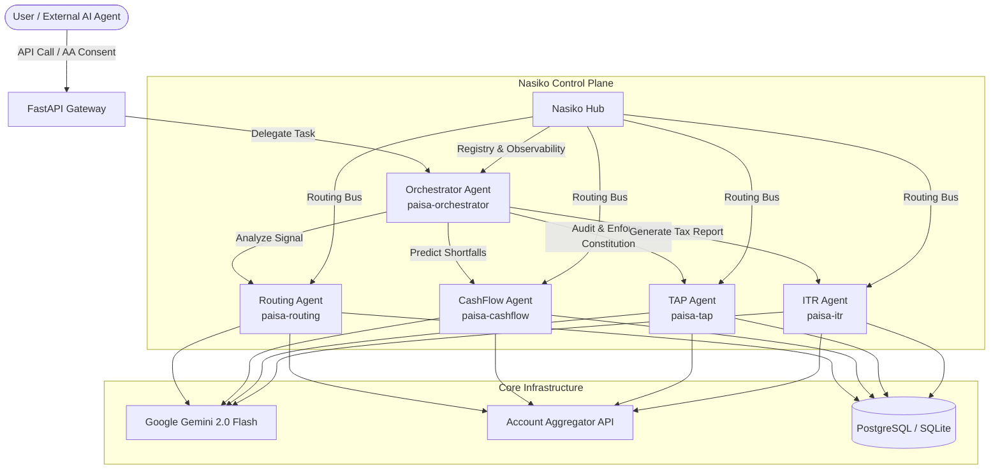
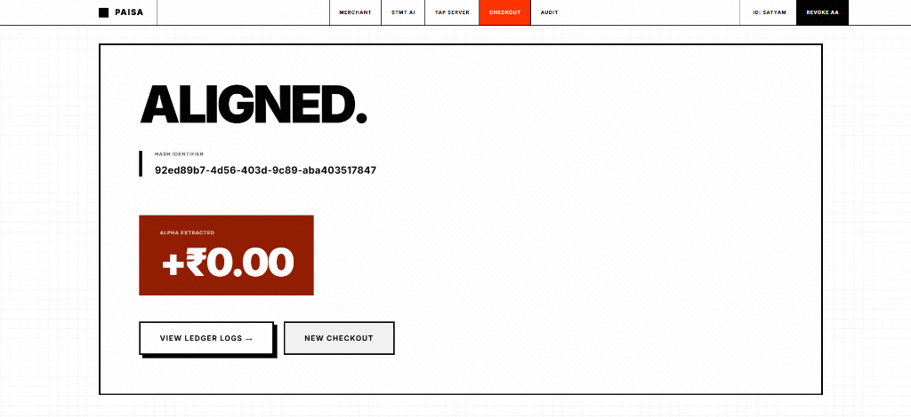
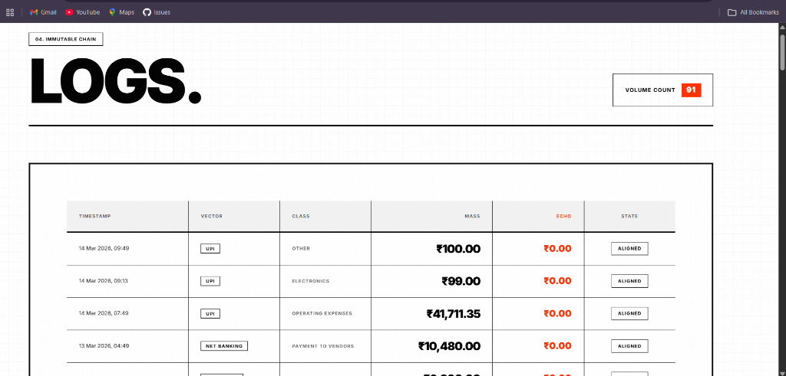
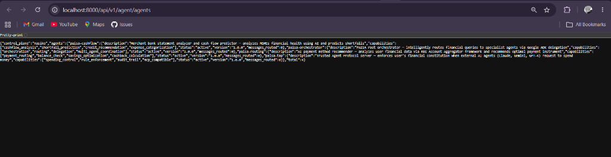

<div align="center">

# 🪙 PAISA
### **Enterprise Multi-Agent Financial Orchestration & Intelligence Platform**

*Orchestrated Agentic Workflows • Google Gemini 2.0 • Nasiko Control Plane • Secure Payment Routing*

<br/>

[](https://ai.google.dev/)
[](https://nasiko.com)
[](https://fastapi.tiangolo.com)
[](https://reactjs.org/)
[](LICENSE)
[]()

<br/>

**PAISA** is a production-grade multi-agent financial intelligence and orchestration platform. By leveraging the **RBI Account Aggregator (AA)** framework, **Google ADK + Gemini**, and the **Nasiko control plane**, PAISA delivers intelligent transaction routing, cashflow analytics, automated ITR compliance, and secure agentic spending governance.

[Explore Docs](#) • [View API Reference](#-api-reference) • [Request Demo](#)

</div>

---

## 📋 Table of Contents

- [The Financial Challenge & PAISA Solution](#-the-financial-challenge--paisa-solution)
- [System Architecture](#-system-architecture)
- [Key Product Pillars](#-key-product-pillars)
- [Agentic Roles & Capabilities](#-agentic-roles--capabilities)
- [Technology Stack](#-technology-stack)
- [Platform Showcase](#-platform-showcase)
- [Getting Started](#-getting-started)
- [Enterprise Deployment](#-enterprise-deployment)
- [API Reference](#-api-reference)

---

## 🚨 The Financial Challenge & PAISA Solution

### The Problem: Dumb Checkouts & Segmented Financial Data
Modern payment gateways are static and context-blind. They present a list of payment options (Cards, UPI, Netbanking) without analyzing the user's immediate financial health. Users encounter transaction declines, overdraft fees, or suboptimal credit use. Outside of checkout, individuals and merchants face high friction in accounting—manually reconciling statements, managing cash flow, and filing taxes.

### The Solution: PAISA Agentic Mesh
PAISA orchestrates a network of **Google ADK agents** to automate complex financial decisions:
1. **Consent-Driven Intelligence:** Connects to the RBI Account Aggregator framework to securely fetch financial telemetry.
2. **Context-Aware Routing:** Recommends the optimal payment instrument (e.g., credit card vs. UPI) based on liquid balance, interest-free cycles, and reward alignment.
3. **Automated Compliance:** Synthesizes statement logs to compile tax liability analyses and draft tax filings (e.g., ITR-4) automatically.
4. **Agentic Spending Governance (TAP):** Enforces user-configured spending policies ("Financial Constitutions") on external AI agents performing transactions.

---

## 🏗️ System Architecture

PAISA operates using a modular, service-oriented architecture with a FastAPI gateway routing client queries to a multi-agent network orchestrated via Google ADK and managed by the Nasiko control plane.



---

## 🔥 Key Product Pillars

<table>
<tr>
<td width="50%">

### 🧠 Intelligent Multi-Agent Routing
Uses Google ADK orchestrators and **Gemini 2.0 Flash** to direct tasks to specialized agents. Evaluates liquid capital, credit lines, and reward points in real time.

</td>
<td width="50%">

### 🛡️ Trusted Agent Protocol (TAP)
Enables secure autonomous spending for external AI agents. Validates requests against an immutable, user-defined **Financial Constitution** and logs all decisions.

</td>
</tr>
<tr>
<td width="50%">

### 📊 ITR & Tax Compliance
Automates Indian tax evaluation (ITR-4 presumptive tax under Section 44AD). Performs comparisons between the Old and New tax regimes and generates AI advisories.

</td>
<td width="50%">

### 💰 Predictive CashFlow Analytics
Ingests bank statements, classifies expenses, flags anomalies, and forecasts shortfalls. Provides a clean health score for businesses and individuals.

</td>
</tr>
<tr>
<td width="50%">

### 🔗 Nasiko Integration
Maintains centralized registry and schema validation using **AgentCards**. Provides low-latency inter-agent routing and platform observability.

</td>
<td width="50%">

### ⚡ Secure Handshakes
Integrates with the **RBI Account Aggregator** flow using temporary session tokens and cryptographic data structures to keep user credentials private.

</td>
</tr>
</table>

---

## 🤖 Agentic Roles & Capabilities

PAISA relies on five specialized AI agents, each structured with dedicated tools and registered in the control plane:

| Agent Name | ADK Identifier | Core Responsibility | Primary Tools / Integrations |
| :--- | :--- | :--- | :--- |
| **Root Orchestrator** | `paisa-orchestrator` | Evaluates incoming tasks, routes sub-tasks to specialists, and synthesizes final responses. | Sub-agent delegation protocol |
| **Routing Agent** | `paisa-routing` | Analyzes liquid cash, credit card due dates, and transactional fees to find optimal payment paths. | `get_payment_recommendation`, `check_account_balance` |
| **CashFlow Agent** | `paisa-cashflow` | Parses statements to categorize overhead, calculate burn rate, and flag upcoming financial deficits. | `analyze_merchant_cashflow`, `predict_shortfall`, `get_expense_breakdown` |
| **TAP Governance Agent** | `paisa-tap` | Screens payment requests from external bots against pre-configured spending policies. | `evaluate_spending_request`, `get_financial_constitution`, `get_agent_audit_trail` |
| **ITR Compliance Agent** | `paisa-itr` | Analyzes business logs and balances to determine tax liabilities, deductions, and regime preferences. | `generate_itr_report`, `compare_tax_regimes`, `get_tax_advisory` |

---

## 🛠️ Technology Stack

```
Frontend Stack             Backend Stack             AI & Infrastructure
┌──────────────────────┐   ┌─────────────────────┐   ┌───────────────────────────┐
│ • React 18 / JSX     │   │ • Python 3.12       │   │ • Google ADK              │
│ • Tailwind CSS       │   │ • FastAPI / Uvicorn │   │ • Gemini 2.0 (Vertex AI)  │
│ • Lucide UI Icons    │   │ • PostgreSQL        │   │ • Nasiko Control Plane    │
│ • Recharts (Graphs)  │   │ • SQLAlchemy 2.0    │   │ • Google Cloud Run        │
└──────────────────────┘   └─────────────────────┘   └───────────────────────────┘
```

---

## 📸 Platform Showcase

### 1. Secure AI-Aligned Checkout
After performing real-time transaction analysis, the PAISA engine displays the recommended payment method, details potential cashback/savings, and outputs a cryptographic verification hash.



<br/>

### 2. Tamper-Proof Audit Logs
Every payment routing request, statement check, or TAP evaluation is written to an immutable system log with classifications, transaction values (₹), and policy compliance indicators.



<br/>

### 3. Nasiko Agent Registry
The control plane exposes metadata, capabilities, and schemas for all active agents. Developers can query live endpoints to track registered AgentCards.



---

## 🏁 Getting Started

### Prerequisites
Make sure your system meets the following version requirements:
- **Node.js**: `v18.0.0+`
- **Python**: `v3.12.0+`
- **Database**: PostgreSQL (or SQLite for local development)
- **API Keys**: Active Gemini API key or Vertex AI access credentials

---

### Installation & Local Setup

#### Step 1: Clone the Repository
```bash
git clone https://github.com/your-org/paisa.git
cd paisa
```

#### Step 2: Configure the Backend Service
1. Navigate to the backend directory and set up a virtual environment:
   ```bash
   cd backend
   python -m venv venv
   source venv/bin/activate  # On Windows, use: .\venv\Scripts\activate
   ```
2. Install the backend dependencies:
   ```bash
   pip install -r requirements.txt
   ```
3. Create a `.env` file in the `backend/` directory:
   ```env
   # Google Gemini API
   GOOGLE_API_KEY=your_gemini_api_key_here
   GEMINI_MODEL=gemini-2.0-flash

   # Database Settings
   DATABASE_URL=sqlite+aiosqlite:///./paisa.db

   # Nasiko Control Plane
   NASIKO_ENABLED=true
   ```
4. Start the FastAPI development server:
   ```bash
   uvicorn main:app --reload --port 8000
   ```

#### Step 3: Configure the Frontend Service
1. Open a new terminal and navigate to the frontend directory:
   ```bash
   cd ../frontend
   ```
2. Install the frontend dependencies:
   ```bash
   npm install
   ```
3. Start the local development server:
   ```bash
   npm start
   ```

---

### Step-by-Step Flow Validation
1. **User Login**: Input mock user UUID `2305062005` to trigger the Account Aggregator authorization simulation.
2. **Initiate Payment**: Submit a payment request (e.g., ₹500) and watch the routing agent choose between your active credit cards or UPI.
3. **Upload Financial Data**: Go to the CashFlow page and upload a sample merchant statement to visualize business metrics and income distributions.
4. **Tax Summary**: Visit the ITR tab to calculate liabilities under the Old and New Indian tax regimes and read the AI tax recommendation.
5. **Chat Interface**: Interact with the orchestrator directly using the built-in system prompt terminal to query your financial status.

---

## ☁️ Enterprise Deployment

### Deployment to Google Cloud Run
PAISA is packaged to deploy on serverless platforms using Docker. Run the following commands to deploy the backend service:

```bash
# Log in to Google Cloud SDK
gcloud auth login
gcloud config set project YOUR_PROJECT_ID

# Deploy the backend microservice
gcloud run deploy paisa-backend \
  --source ./backend \
  --region us-central1 \
  --allow-unauthenticated \
  --set-env-vars GOOGLE_API_KEY=your_api_key,NASIKO_ENABLED=true
```

You can also automate deployment utilizing the included `cloudbuild.yaml` pipeline:
```bash
gcloud builds submit --config cloudbuild.yaml --substitutions=_GOOGLE_API_KEY=your_api_key
```

---

## 📡 API Reference

### 1. Multi-Agent Orchestration
| Method | HTTP Endpoint | Description |
| :--- | :--- | :--- |
| `POST` | `/api/v1/agent/chat` | Send a prompt to the `paisa-orchestrator` agent. |
| `GET` | `/api/v1/agent/agents` | Retrieve all agents registered in the Nasiko control plane. |
| `POST` | `/api/v1/agent/route` | Route a direct message to a specific agent using the Nasiko bus. |
| `GET` | `/api/v1/agent/metrics` | Retrieve transaction logs and system health telemetry. |
| `GET` | `/api/v1/agent/graph` | Fetch the multi-agent network dependency mapping. |

### 2. Tax & Compliance
| Method | HTTP Endpoint | Description |
| :--- | :--- | :--- |
| `GET` | `/api/v1/itr/report/{user_id}` | Fetch the comprehensive ITR report details for a user. |
| `GET` | `/api/v1/itr/report/{user_id}/regime-comparison` | Fetch a comparative analysis between the Old and New tax regimes. |
| `POST` | `/api/v1/itr/report/{user_id}/ai-advisory` | Request a customized tax planning verdict from the ITR agent. |

### 3. Core Transaction Processing
| Method | HTTP Endpoint | Description |
| :--- | :--- | :--- |
| `POST` | `/api/v1/recommend-payment` | Evaluate account liquidity and suggest payment routing options. |
| `POST` | `/api/v1/payment` | Submit and record a transaction in the database ledger. |
| `POST` | `/api/v1/tap/request` | Submit a spending authorization request to the TAP agent. |
| `POST` | `/api/v1/merchant/analyze-statement` | Upload and extract analytics from business bank statement files. |
| `GET` | `/health` | Check overall system service status. |

---

<div align="center">

```
© 2026 PAISA AI Systems. All rights reserved.
```

[](https://google.github.io/adk-docs/)
[](https://nasiko.com)
[](https://cloud.google.com/run)

</div>